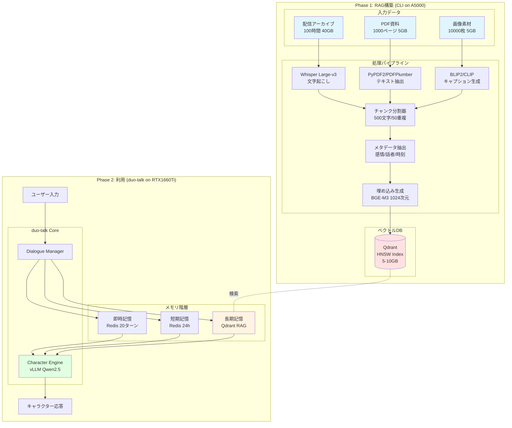
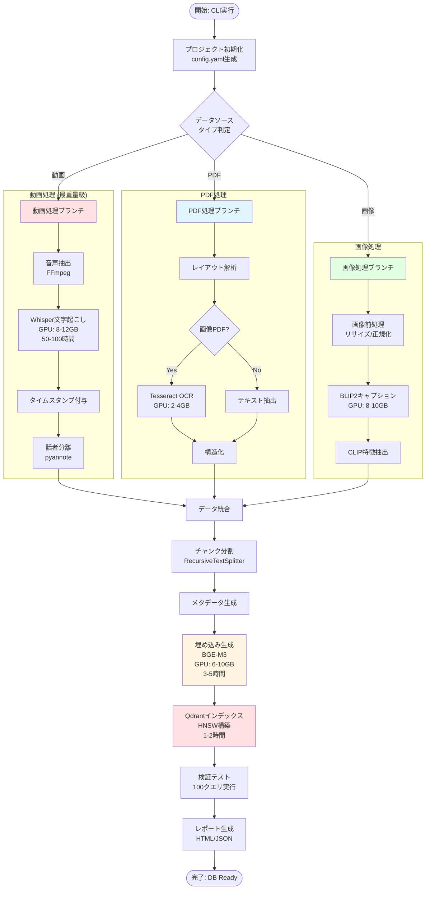
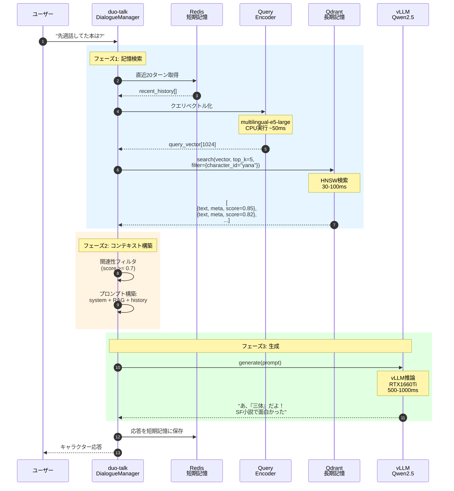
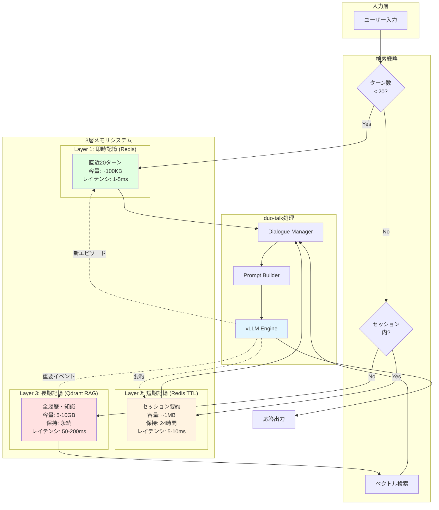
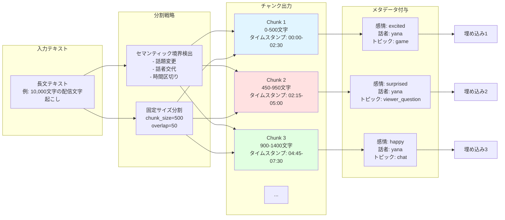
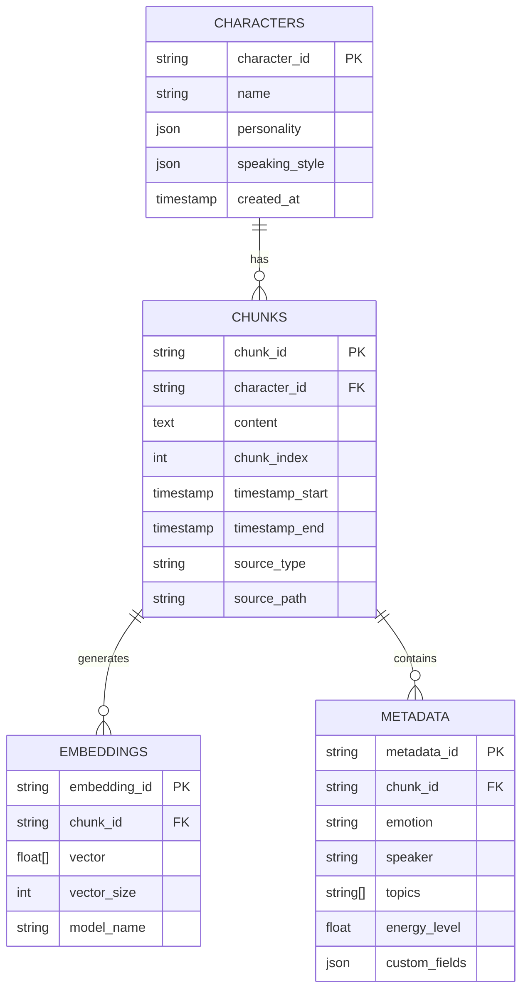
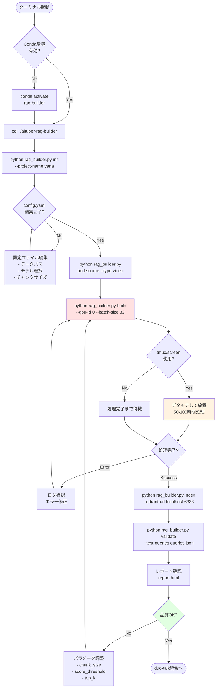
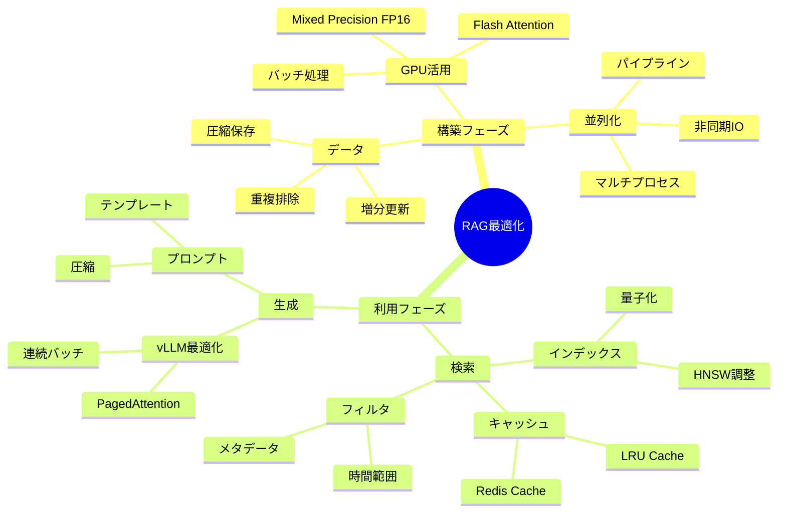
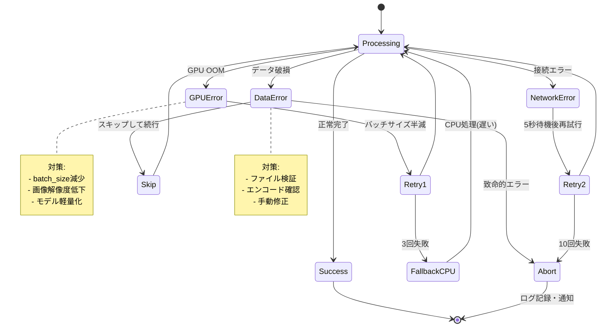

# AITuber RAGシステム アーキテクチャ図集

## 1. 全体システム構成



---

## 2. 構築フェーズ詳細フロー



---

## 3. 利用フェーズ検索フロー



---

## 4. メモリ階層統合アーキテクチャ



---

## 5. チャンク分割戦略



---

## 6. GPU使用率タイムライン（構築フェーズ）

```mermaid
gantt
    title A5000 GPU使用率 (100時間分データ処理)
    dateFormat HH:mm
    axisFormat %H:%M
    
    section 音声処理
    Whisper文字起こし (12GB)     :active, w1, 00:00, 50h
    
    section PDF処理
    Tesseract OCR (4GB)           :active, p1, 50:00, 5h
    
    section 画像処理
    BLIP2キャプション (10GB)      :active, i1, 55:00, 3h
    
    section 埋め込み
    BGE-M3生成 (8GB)              :active, e1, 58:00, 5h
    
    section インデックス
    Qdrant構築 (2GB)              :active, q1, 63:00, 2h
    
    section 検証
    テスト実行 (1GB)              :active, v1, 65:00, 1h
```

---

## 7. データベーススキーマ



---

## 8. CLI実行フローチャート



---

## 9. パフォーマンス最適化ポイント



---

## 10. エラーハンドリングフロー



---

**ドキュメントバージョン**: v1.0  
**図集作成日**: 2025-01-11  
**対象システム**: duo-talk AITuber RAG統合
