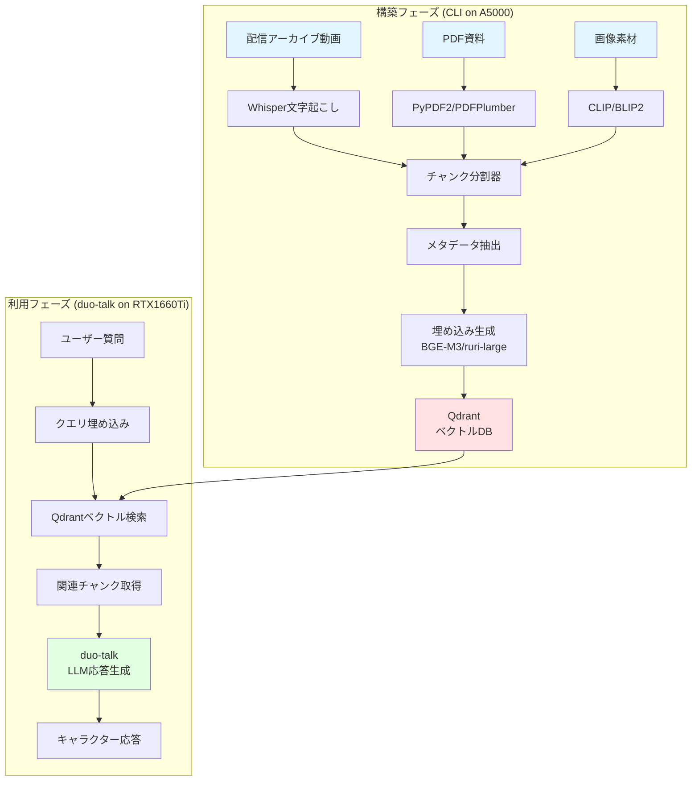
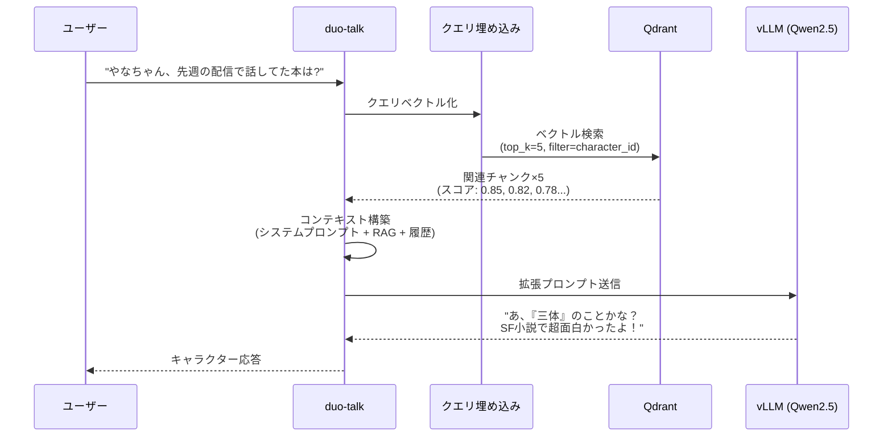
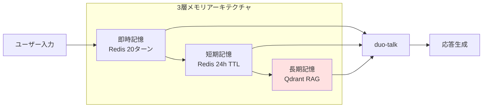

# AITuber RAGシステム基本仕様書 v1.0

## 📋 目次
1. [システム概要と目的](#1-システム概要と目的)
2. [メリット・デメリット分析](#2-メリットデメリット分析)
3. [リソース要件](#3-リソース要件)
4. [システムアーキテクチャ](#4-システムアーキテクチャ)
5. [2フェーズアプローチ](#5-2フェーズアプローチ)
6. [実装ロードマップ](#6-実装ロードマップ)

---

## 1. システム概要と目的

### 1.1 目的
**長期記憶を持つAITuberキャラクターの実現**

- **短期記憶の限界克服**: LLMのコンテキストウィンドウ（4K-32K トークン）を超えた記憶
- **キャラクター一貫性の維持**: 過去の発言・エピソードに基づく性格の持続
- **知識の拡張**: PDFドキュメント、画像、配信アーカイブからの学習
- **関係性の記憶**: 視聴者との過去のやり取りを記憶・参照

### 1.2 適用シナリオ

```
配信アーカイブ ─┐
設定資料PDF   ─┤→ RAG構築 → 長期記憶DB → duo-talk → 配信応答
キャラ画像    ─┘                              ↓
                                          新エピソード
                                              ↓
                                          (フィードバック)
```

---

## 2. メリット・デメリット分析

### 2.1 メリット

| カテゴリ | 内容 |
|---------|------|
| **キャラクター性** | 過去の発言と矛盾しない一貫した性格維持 |
| **視聴者体験** | 「覚えていてくれる」感動体験の提供 |
| **知識拡張** | リアルタイムに学習できない情報の補完 |
| **コスト削減** | 長いプロンプトを毎回送信しなくて済む |
| **スケーラビリティ** | 100時間分の配信データも検索可能 |

### 2.2 デメリット

| カテゴリ | 内容 | 対策 |
|---------|------|------|
| **初期構築コスト** | GPU資源を大量消費（数時間〜数日） | A5000で夜間バッチ処理 |
| **検索遅延** | ベクトル検索に50-200ms | キャッシュ+インデックス最適化 |
| **ストレージ** | 100時間で5-10GB程度 | 定期的な古いデータの圧縮 |
| **メンテナンス** | 定期的な再インデックスが必要 | 週次自動実行スクリプト |
| **誤検索リスク** | 無関係な情報を引く可能性 | スコアリング閾値の調整 |

---

## 3. リソース要件

### 3.1 構築フェーズ（CLI実行 on A5000）

#### GPU要件
```yaml
推奨環境: RTX A5000 (24GB)
用途別GPU使用率:
  - PDF処理 (OCR):
      GPU: 2-4GB
      処理速度: 100ページ/分
  - 画像処理 (CLIP/BLIP):
      GPU: 8-12GB
      処理速度: 200枚/分
  - 埋め込み生成:
      GPU: 6-10GB
      処理速度: 10,000チャンク/分
  - 全体同時実行時:
      GPU: 18-20GB (ピーク)
```

#### メモリ・ストレージ
```yaml
システムメモリ: 32GB推奨 (最低16GB)
ストレージ:
  - 入力データ: ~50GB
    - 配信アーカイブ動画: 40GB (100時間 @ 400MB/h)
    - PDF資料: 5GB
    - 画像素材: 5GB
  - 処理中一時ファイル: ~100GB
  - 最終ベクトルDB: 5-10GB
  - 合計: 約160-200GB
```

#### 処理時間見積もり
```yaml
100時間分の配信データ処理:
  1. 音声文字起こし: 50-100時間 (Whisper Large)
  2. PDF抽出: 2-5時間 (1,000ページ想定)
  3. 画像処理: 1-3時間 (10,000枚想定)
  4. チャンク分割: 1時間
  5. 埋め込み生成: 3-5時間
  6. インデックス構築: 1-2時間
  合計: 58-116時間 (2.5-5日)
```

### 3.2 利用フェーズ（duo-talk統合 on RTX1660Ti）

#### GPU要件
```yaml
推奨環境: RTX 1660 Ti (6GB) で十分
用途別GPU使用率:
  - ベクトル検索: CPU実行 (GPUほぼ不要)
  - LLM推論 (vLLM): 4-5GB (Qwen2.5-7B-AWQ)
  - 合計: 4-5GB
  
注意: RAG検索自体はCPU/RAM主体、GPU負荷なし
```

#### メモリ・レイテンシ
```yaml
システムメモリ: 16GB推奨
検索レイテンシ:
  - ベクトル検索: 30-100ms
  - メタデータフィルタ: 10-20ms
  - リランキング: 20-50ms
  - 合計: 60-170ms (平均100ms)
```

---

## 4. システムアーキテクチャ

### 4.1 全体構成図



### 4.2 データフロー詳細



### 4.3 メモリ階層統合



---

## 5. 2フェーズアプローチ

### 5.1 Phase 1: RAG構築（CLI）

#### 実行環境
```bash
# Ubuntu 24.04 + RTX A5000
# 推奨: tmux/screenで長時間実行

conda activate rag-builder
cd ~/aituber-rag-builder
```

#### CLIコマンド設計
```bash
# 1. プロジェクト初期化
python rag_builder.py init --project-name "yana-character" \
    --character-id "yana_001"

# 2. データソース登録
python rag_builder.py add-source \
    --type video \
    --path /data/archives/*.mp4 \
    --transcribe-model whisper-large-v3

python rag_builder.py add-source \
    --type pdf \
    --path /data/docs/*.pdf \
    --ocr-enable

python rag_builder.py add-source \
    --type image \
    --path /data/images/*.png \
    --caption-model blip2

# 3. 処理実行
python rag_builder.py build \
    --embedding-model intfloat/multilingual-e5-large \
    --chunk-size 500 \
    --chunk-overlap 50 \
    --gpu-id 0 \
    --batch-size 32

# 4. インデックス構築
python rag_builder.py index \
    --qdrant-url localhost:6333 \
    --collection-name yana_memory \
    --vector-size 1024

# 5. 検証
python rag_builder.py validate \
    --test-queries queries.json \
    --output-report report.html
```

#### ディレクトリ構造
```
~/aituber-rag-builder/
├── config/
│   └── yana_config.yaml
├── data/
│   ├── raw/                # 入力データ
│   │   ├── videos/
│   │   ├── pdfs/
│   │   └── images/
│   ├── processed/          # 処理済み
│   │   ├── transcripts/
│   │   ├── extracted_text/
│   │   └── captions/
│   └── embeddings/         # 埋め込み
├── outputs/
│   ├── chunks.jsonl        # 分割チャンク
│   ├── metadata.json       # メタデータ
│   └── build_report.html   # レポート
└── rag_builder.py          # CLIツール
```

### 5.2 Phase 2: duo-talk統合

#### 統合ポイント
```python
# duo-talk/src/memory/rag_memory.py

from qdrant_client import QdrantClient
from sentence_transformers import SentenceTransformer

class RAGMemory:
    def __init__(self, collection_name="yana_memory"):
        self.client = QdrantClient(host="localhost", port=6333)
        self.encoder = SentenceTransformer(
            "intfloat/multilingual-e5-large"
        )
        self.collection = collection_name
    
    def retrieve(self, query: str, top_k=5, character_id=None):
        """長期記憶検索"""
        # クエリベクトル化
        query_vector = self.encoder.encode(query).tolist()
        
        # フィルタ設定
        filter_condition = None
        if character_id:
            filter_condition = {
                "must": [
                    {"key": "character_id", "match": {"value": character_id}}
                ]
            }
        
        # 検索
        results = self.client.search(
            collection_name=self.collection,
            query_vector=query_vector,
            limit=top_k,
            query_filter=filter_condition,
            score_threshold=0.7  # 関連性閾値
        )
        
        return [
            {
                "text": hit.payload["text"],
                "metadata": hit.payload["metadata"],
                "score": hit.score
            }
            for hit in results
        ]
```

#### duo-talkへの組み込み
```python
# duo-talk/src/dialogue_manager.py

class DialogueManager:
    def __init__(self):
        self.rag_memory = RAGMemory()
        self.redis_memory = RedisMemory()  # 短期記憶
        
    def generate_response(self, user_input, character_id):
        # 1. 即時記憶取得（Redis）
        recent_history = self.redis_memory.get_recent(20)
        
        # 2. 長期記憶検索（RAG）
        long_term_context = self.rag_memory.retrieve(
            query=user_input,
            top_k=3,
            character_id=character_id
        )
        
        # 3. プロンプト構築
        prompt = self._build_prompt(
            user_input=user_input,
            recent_history=recent_history,
            long_term_context=long_term_context
        )
        
        # 4. LLM生成
        response = self.llm.generate(prompt)
        
        return response
```

---

## 6. 実装ロードマップ

### 6.1 Week 1-2: RAG構築CLI開発

```yaml
タスク:
  - [ ] プロジェクト初期化コマンド
  - [ ] Whisper文字起こし統合
  - [ ] PDF抽出パイプライン
  - [ ] 画像キャプション生成
  - [ ] チャンク分割ロジック
  - [ ] メタデータ設計・実装
  
成果物:
  - rag_builder.py (CLI)
  - config.yaml (設定テンプレート)
  - README.md (使い方)
```

### 6.2 Week 3: 埋め込み＆インデックス

```yaml
タスク:
  - [ ] 埋め込みモデル選定・テスト
  - [ ] バッチ処理最適化
  - [ ] Qdrantセットアップ
  - [ ] インデックス構築スクリプト
  - [ ] 検証クエリ作成
  
成果物:
  - embeddings/ (生成済み埋め込み)
  - Qdrant collection (インデックス)
  - validation_report.html
```

### 6.3 Week 4: duo-talk統合

```yaml
タスク:
  - [ ] RAGMemoryクラス実装
  - [ ] DialogueManager統合
  - [ ] レイテンシ計測・最適化
  - [ ] エラーハンドリング
  - [ ] 統合テスト
  
成果物:
  - duo-talk/src/memory/rag_memory.py
  - 統合テスト結果レポート
```

### 6.4 Week 5: 評価・改善

```yaml
タスク:
  - [ ] 検索精度評価 (Recall@K)
  - [ ] レスポンス品質評価
  - [ ] キャラクター一貫性テスト
  - [ ] パフォーマンスチューニング
  - [ ] ドキュメント整備
  
成果物:
  - 評価レポート
  - 最適化済みシステム
  - 運用マニュアル
```

---

## 付録A: 推奨技術スタック

### A.1 構築フェーズ
```yaml
音声文字起こし: openai/whisper-large-v3
PDF処理: pypdf2, pdfplumber, pytesseract (OCR)
画像処理: BLIP-2, CLIP
埋め込み: intfloat/multilingual-e5-large または cl-nagoya/ruri-large-v3
チャンク分割: LangChain RecursiveCharacterTextSplitter
CLI: Click or Typer
進捗表示: tqdm, rich
```

### A.2 利用フェーズ
```yaml
ベクトルDB: Qdrant
クエリ埋め込み: 構築時と同じモデル
LLM: vLLM + Qwen2.5-7B-Instruct-AWQ
メモリ: Redis (短期), Qdrant (長期)
```

---

## 付録B: コスト見積もり

### B.1 ハードウェアコスト
```
既存環境利用: 0円
  - A5000: 構築フェーズ
  - RTX1660Ti: 利用フェーズ

追加ストレージ: 5,000-10,000円
  - 1TB SSD (RAGデータ専用)
```

### B.2 電気代概算
```
構築フェーズ (5日間):
  - A5000: 230W × 120h = 27.6kWh
  - 電気代: 約800円 (@30円/kWh)

利用フェーズ (月間):
  - RTX1660Ti: 120W × 720h = 86.4kWh
  - 電気代: 約2,600円/月
```

---

## 付録C: トラブルシューティング

### C.1 構築フェーズ
```
問題: GPU OOM (Out of Memory)
対策:
  - バッチサイズを減らす (32 → 16 → 8)
  - 処理を分割実行
  - 画像解像度を下げる

問題: Whisper処理が遅い
対策:
  - whisper-large → whisper-medium
  - CTranslate2で高速化
  - GPUを2枚使う (A5000 + 2080Super)
```

### C.2 利用フェーズ
```
問題: 検索レイテンシ高い
対策:
  - インデックスパラメータ調整 (ef値)
  - キャッシュ有効化
  - フィルタ条件最適化

問題: 関連性の低い結果が返る
対策:
  - score_threshold を上げる (0.7 → 0.75)
  - top_k を増やして再ランキング
  - メタデータフィルタ強化
```

---

**仕様書バージョン**: v1.0  
**最終更新**: 2025-01-11  
**作成者**: Tsuyoshi + Claude  
**対象システム**: duo-talk AITuber RAG統合
