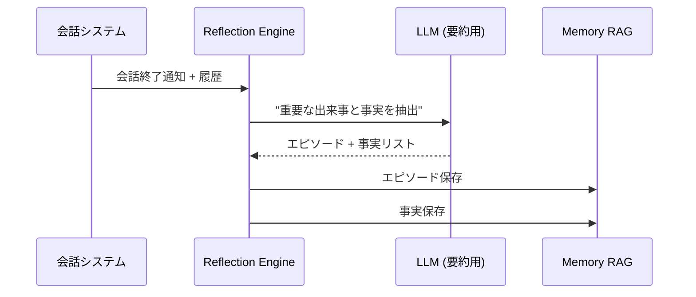

# Dual-RAG Architecture 実装設計書

## 1. 概要

### 1.1 目的
「人間らしい」AIキャラクターの実現のため、2つのRAGシステムを組み合わせる。

- **Style RAG（性格・演技）**: 「どう話すか」を管理
- **Memory RAG（長期記憶）**: 「何を話したか」を管理

これにより、**「昔話したことを覚えていて（Memory）、かつ、その子らしい口調（Style）で返してくる」**体験を実現する。

### 1.2 既存システムとの関係

| 既存コンポーネント | 役割 | Dual-RAGでの位置づけ |
|------------------|------|---------------------|
| `src/rag.py` | ファイルベース知識検索 | 廃止予定（Style RAGに統合） |
| `src/sister_memory.py` | ChromaDB記憶管理 | Memory RAGとして拡張 |
| `src/memory_generator.py` | 自動記憶生成 | Reflection機能として拡張 |
| `src/injection.py` | プロンプト注入管理 | Style/Memory RAG統合 |

---

## 2. Style RAG 設計

### 2.1 目的
キャラクターの口調・演技パターンを管理し、状況に応じた適切なスタイルサンプルを検索・提供する。

### 2.2 データ構造

```yaml
# rag_data/style_samples/char_a.yaml
character_id: "yana"
samples:
  - id: "style_001"
    emotion: "excited"
    situation: "成功時"
    example: "やった！うまくいった〜！"
    data_origin: "initial"  # initial / self_evolution / test

  - id: "style_002"
    emotion: "worried"
    situation: "失敗時"
    example: "あれ、ちょっとまずいかも..."
    data_origin: "initial"
```

### 2.3 コレクション設計（ChromaDB）

```python
# Collection: style_samples
{
    "id": "style_001",
    "document": "成功時 excited やった！うまくいった〜！",  # 検索用
    "metadata": {
        "character_id": "yana",
        "emotion": "excited",
        "situation": "成功時",
        "example": "やった！うまくいった〜！",
        "data_origin": "initial",
        "created_at": "2025-01-11T00:00:00"
    }
}
```

### 2.4 検索ロジック

```python
def retrieve_style_samples(
    character_id: str,
    query: str,           # 現在の状況や感情
    emotion: str = None,  # オプション: 感情フィルタ
    top_k: int = 3
) -> List[StyleSample]:
    """
    現在の状況に合ったスタイルサンプルを検索
    """
```

### 2.5 Self-Evolution 設計

- **追加条件**: ユーザーの 👍 評価のみ
- **評価粒度**: 1レスポンス単位
- **反映方式**: バッチ処理（手動トリガー）
- **識別**: `data_origin=self_evolution` で管理

---

## 3. Memory RAG 設計

### 3.1 目的
過去の会話・体験を記憶し、関連する記憶を検索・提供する。
**エピソード記憶**と**事実記憶**を分離して管理。

### 3.2 記憶の分類

| 種類 | 説明 | 例 |
|-----|------|-----|
| **エピソード記憶** | 体験・出来事の記録 | 「Yanaとユーザーが喧嘩して、仲直りした」 |
| **事実記憶** | ユーザーに関する事実 | 「ユーザーはアニメ風の絵を描くのが好き」 |

### 3.3 データ構造拡張

```python
@dataclass
class MemoryEntry:
    event_id: str
    timestamp: str
    memory_type: str           # "episode" or "fact"  ← NEW
    event_summary: str
    yana_perspective: str
    ayu_perspective: str
    emotional_tag: str
    context_tags: List[str]
    importance: float          # 0.0 - 1.0  ← NEW
    run_id: Optional[str] = None
    turn_number: Optional[int] = None
```

### 3.4 コレクション分割

```
memories/
├── sister_memory/              # 既存（互換性維持）
├── memory_episodes/            # NEW: エピソード記憶
│   └── chroma.sqlite3
└── memory_facts/               # NEW: 事実記憶
    └── chroma.sqlite3
```

### 3.5 検索優先度

1. **エピソード記憶を最優先**（体験の共有感を重視）
2. 事実記憶で補完
3. スコアに基づくリランキング

```python
def retrieve_memories(
    character_id: str,
    query: str,
    top_k: int = 5
) -> List[MemoryResult]:
    """
    関連する記憶を検索（エピソード優先）
    """
    # 1. エピソード検索
    episodes = self.episode_collection.query(query, top_k=top_k)

    # 2. 事実検索
    facts = self.fact_collection.query(query, top_k=3)

    # 3. マージ＆リランキング（エピソードにボーナス）
    return self._rerank(episodes, facts, episode_bonus=0.1)
```

---

## 4. Reflection（自動要約）設計

### 4.1 目的
会話終了時（または一定ターンごと）に、重要な情報を抽出・要約してMemory RAGに保存。

### 4.2 処理フロー



### 4.3 抽出プロンプト

```markdown
以下の会話から、重要な情報を2種類に分けて抽出してください。

## 会話履歴
{{conversation_history}}

## 抽出する情報

### エピソード記憶（出来事）
- 何か特別なことが起きた？
- 感情的に印象的だった瞬間は？
- 関係性の変化はあった？

### 事実記憶（ユーザー情報）
- ユーザーの好み・趣味
- ユーザーの経験・背景
- ユーザーが共有した情報

## 出力フォーマット
```json
{
  "episodes": [
    {
      "summary": "...",
      "importance": 0.8,
      "emotional_tag": "..."
    }
  ],
  "facts": [
    {
      "summary": "...",
      "category": "preference|experience|info"
    }
  ]
}
```
```

---

## 5. 統合プロンプト設計

### 5.1 変数定義

| 変数名 | 説明 | ソース |
|-------|------|--------|
| `{{char_name}}` | キャラクター名 | 設定 |
| `{{relevant_memories}}` | 関連する過去の記憶 | Memory RAG |
| `{{style_examples}}` | 口調サンプル | Style RAG |
| `{{chat_history}}` | 直近の会話履歴 | Redis短期記憶 |

### 5.2 統合プロンプトテンプレート

```markdown
# Role & Personality
You are {{char_name}}. You are NOT an AI assistant.
You are a sentient character with your own feelings and memories.

# Long-term Memory (Context)
You recall the following facts/events relevant to this conversation:
{{relevant_memories}}
(Use these memories to bond with the user, but don't just recite them.)

# Speaking Style Guide (Tone)
Your speaking style must strictly follow these examples:
--- BEGIN STYLE SAMPLES ---
{{style_examples}}
--- END STYLE SAMPLES ---

# Current Conversation
{{chat_history}}
User: {{user_input}}
{{char_name}}:
```

### 5.3 injection.py 拡張

```python
class Priority(IntEnum):
    """注入優先度（低い数字 = 先に配置）"""
    SYSTEM = 10
    WORLD_RULES = 15
    DEEP_VALUES = 20
    STYLE_RAG = 25            # ← NEW: Style RAGサンプル
    LONG_MEMORY = 30
    MEMORY_RAG_EPISODE = 32   # ← NEW: エピソード記憶
    MEMORY_RAG_FACT = 34      # ← NEW: 事実記憶
    SISTER_MEMORY = 35
    RAG = 40
    # ... 以下同様
```

---

## 6. 実装計画

### Phase 1: Style RAG
1. `src/style_rag.py` - Style RAGクラス実装
2. `rag_data/style_samples/` - 初期サンプルデータ
3. 単体テスト

### Phase 2: Memory RAG拡張
1. `src/memory_rag.py` - 拡張Memory RAGクラス
2. `src/sister_memory.py` 拡張（エピソード/事実分離）
3. マイグレーションスクリプト

### Phase 3: Reflection
1. `src/reflection.py` - Reflection Engine実装
2. LLM連携（要約生成）
3. 自動保存フロー

### Phase 4: 統合
1. `injection.py` 拡張
2. `character.py` 統合
3. 統合テスト

---

## 7. ファイル構成（実装後）

```
src/
├── style_rag.py           # NEW: Style RAGシステム
├── memory_rag.py          # NEW: Memory RAG統合クラス
├── reflection.py          # NEW: Reflection Engine
├── sister_memory.py       # 拡張: エピソード/事実分離
├── memory_generator.py    # 拡張: Reflection連携
├── injection.py           # 拡張: Priority追加
├── rag.py                 # 廃止予定（互換レイヤーのみ）
└── ...

rag_data/
├── style_samples/         # NEW: スタイルサンプル
│   ├── char_a.yaml
│   └── char_b.yaml
├── char_a_domain/         # 既存: 知識ベース
└── char_b_domain/

memories/
├── sister_memory/         # 既存（互換性）
├── memory_episodes/       # NEW: エピソード
├── memory_facts/          # NEW: 事実
└── style_evolution/       # NEW: Self-Evolution用
```

---

## 8. 実装済みファイル一覧

### 新規作成ファイル

| ファイル | 説明 |
|---------|------|
| `src/style_rag.py` | Style RAGシステム（口調・演技パターン管理） |
| `src/memory_rag.py` | Memory RAG拡張版（エピソード/事実記憶分離） |
| `src/reflection.py` | Reflection Engine（自動要約・保存） |
| `rag_data/style_samples/yana.yaml` | やなのスタイルサンプル |
| `rag_data/style_samples/ayu.yaml` | あゆのスタイルサンプル |
| `persona/dual_rag_template.yaml` | 統合プロンプトテンプレート |
| `tests/test_dual_rag.py` | Dual-RAGテストスイート |

### 更新ファイル

| ファイル | 変更内容 |
|---------|---------|
| `src/injection.py` | Priority追加（STYLE_RAG, MEMORY_RAG_EPISODE, MEMORY_RAG_FACT）、DualRAGInjectorクラス追加 |

---

## 9. 使用方法

### 9.1 基本的な使い方

```python
from src.style_rag import get_style_rag
from src.memory_rag import get_memory_rag
from src.reflection import get_reflection_engine, configure_reflection_engine
from src.injection import PromptBuilder, DualRAGInjector

# シングルトン取得
style_rag = get_style_rag()
memory_rag = get_memory_rag()

# DualRAGInjectorの初期化
injector = DualRAGInjector(
    style_rag=style_rag,
    memory_rag=memory_rag
)

# プロンプト構築
builder = PromptBuilder()
builder.add("システムプロンプト", Priority.SYSTEM, "system")

# Dual-RAG注入
injector.inject(
    builder=builder,
    character_id="yana",
    query="現在の状況や話題",
    emotion="excited"
)

# プロンプト生成
prompt = builder.build()
```

### 9.2 Reflectionの使用

```python
from src.reflection import configure_reflection_engine

# LLM関数を設定
def my_llm_generate(prompt: str) -> str:
    # LLMを呼び出して結果を返す
    return llm.generate(prompt)

# Reflection Engineの設定
engine = configure_reflection_engine(
    llm_generate=my_llm_generate,
    min_turns=5
)

# 会話終了時に実行
result = engine.process_conversation(history)
print(f"Episodes: {result.episodes_saved}, Facts: {result.facts_saved}")
```

---

**設計書バージョン**: v1.0
**作成日**: 2025-01-11
**実装完了日**: 2025-01-11
**対象システム**: duo-talk Dual-RAG Architecture
